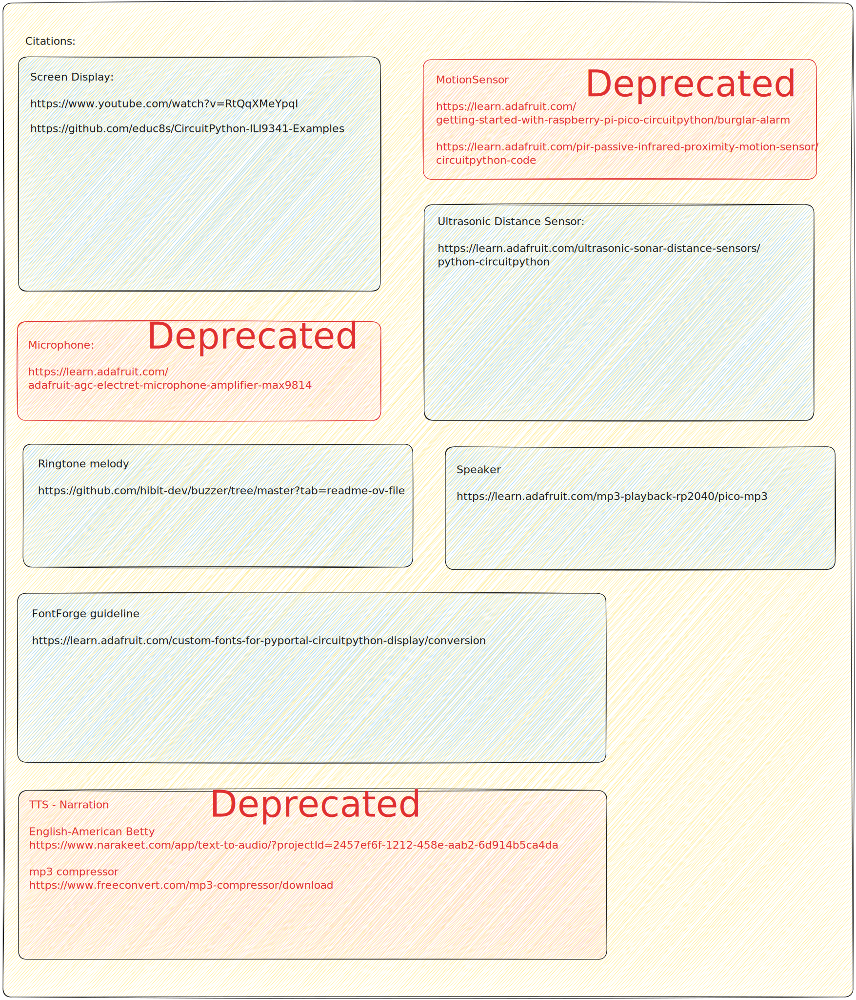

# StudyBuddy

StudyBuddy is a companion bot designed to assist neurodivergent students and others in maintaining focus during study sessions. It enriches the learning environment with music, games, and more, making studying more engaging.


## Features

StudyBuddy includes several key features to enhance the study experience:
- **Focus Timer**: Customize focus sessions according to the Pomodoro technique or your personal preference.
- **Music Player**: Integrated music player that supports playlists to help maintain focus.
- **Interactive Games**: Simple games to play during breaks to help refresh the mind.
- **Alarm**: Intuitive alarm with a fresh melody.

## Installation

To get StudyBuddy up and running, you will need components and a Raspberry Pi Pico W (WiFi capable).

```bash
git clone https://github.com/tfozo/studybuddy.git
cd studybuddy
```

Now, copy all the files in this directory to your Pico, including the *lib* folder (assuming that you have already installed CircuitPython version 8 on your Pico using Thonny).

## Components


**For the screen, I recommend watching this [video on YouTube](https://youtu.be/RtQqXMeYpqI?si=kfrHYlYuN9Sp5zYt) to help you set up the wiring.**

## Citations



## License

This project is free to use under the MIT License.
