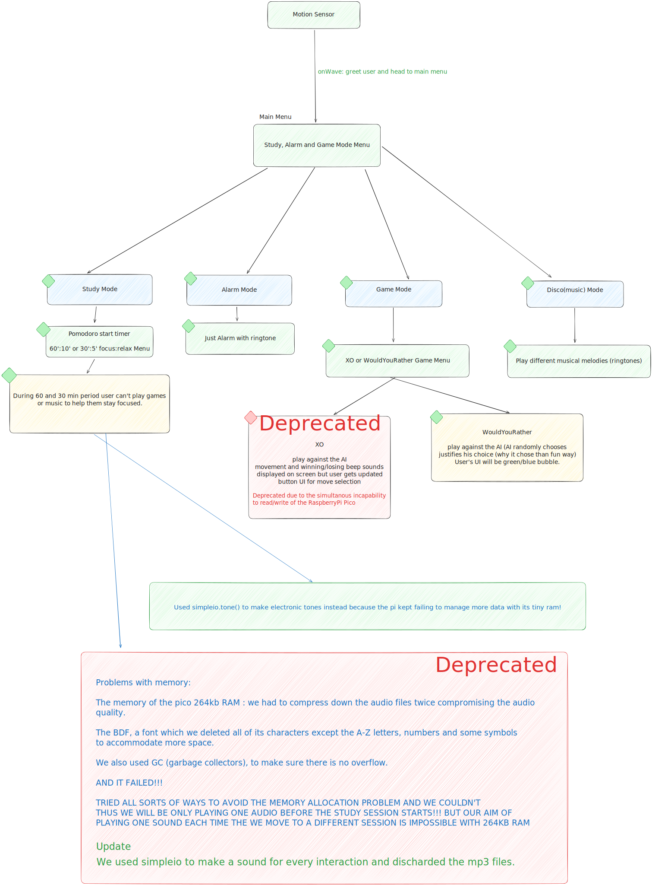
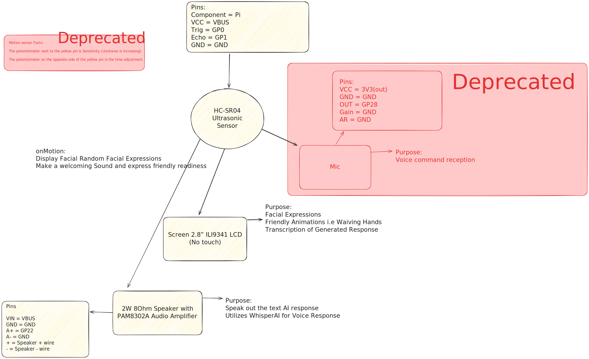

# StudyBuddy
Companion bot aiding neurodivergent students and others in maintaining focus during study sessions, while entertaining them with music, games, and more.

 

## Features

StudyBuddy includes several key features to enhance the study experience:
- **Focus Timer**: Customize focus sessions according to the Pomodoro technique or your personal preference.
- **Music Player**: Integrated music player that supports playlists to help maintain focus.
- **Interactive Games**: Simple games to play during breaks to help refresh the mind.
- **Alarm**: Intiutive alarm with fresh melody.

## Installation

To get StudyBuddy up and running you need componenets and RaspberryPi Pico W. (WIFI cabable)

```bash
git clone https://github.com/yourusername/studybuddy.git
cd studybuddy
```

Now copy all the files in this directory into your pico, including the *lib\* folder. (assuming that you have already installed CircuitPython version 8 on your pico using Thonny.

**Components**

 
